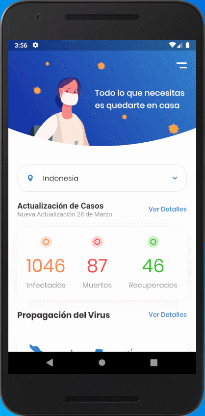

# Proyecto

<table border="0">
    <tr>
        <td></td>
        <td>Ejercicio de diseño centrado en tema de COVID 19</td>
    </tr>
</table>

## Observaciones

Las librerías usadas son:

* flutter_svg: Permite el uso de recursos con extensión *.svg. [Librería](https://pub.dev/packages/flutter_svg).

## Resultados

<table border="0">
    <tr>
        <td></td>
    </tr>
</table>